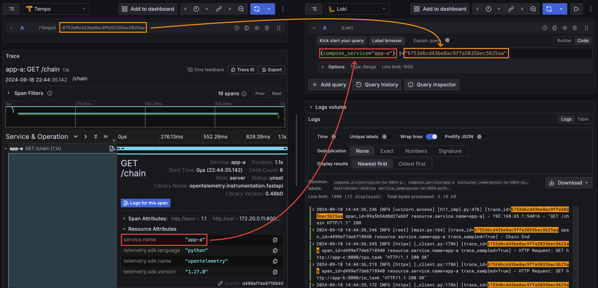

# 全方位強化 Python 服務可觀測性：以 FastAPI 和 Grafana Stack 為例

此 Project 為 PyCon TW 2024 [全方位強化 Python 服務可觀測性：以 FastAPI 和 Grafana Stack 為例](https://tw.pycon.org/2024/zh-hant/conference/talk/320) 的範例程式碼。

Slide：[全方位強化 Python 服務可觀測性：以 FastAPI 和 Grafana Stack 為例]()

## Architecture


1. App：FastAPI Application
   1. basic.py：基本的 FastAPI Application，示範如何使用 [Prometheus Client Library](https://prometheus.github.io/client_python/) 以及 [Zero-code Instrumentation](https://opentelemetry.io/docs/zero-code/python/)
   2. main.py：進階的 FastAPI Application，示範如何使用 [Code-based Instrumentation](https://opentelemetry.io/docs/languages/python/instrumentation/)，並連接 PostgreSQL 和 redis
2. PostgreSQL：資料庫
3. redis：快取資料庫
4. Tempo：接收 OpenTelemetry SKD 發送的 Trace Data
5. Prometheus：爬取 Application 揭露在 `/metrics` 的 Metrics
6. Loki Docker Driver：爬取 Container 的 Log 傳送至 Loki
7. Loki：接收 Loki Docker Driver 傳送的 Log
8. Grafana：查詢 Tempo、Prometheus、Loki 的資料


## Usage

1. Install Loki Docker Driver

```bash
docker plugin install grafana/loki-docker-driver:3.1.1 --alias loki --grant-all-permissions
```

2. Start all services

```bash
docker-compose up -d
```

3. Send Request to applications
   1. With Swagger UI
      1. basic: http://localhost:8080/docs
      2. app-a: http://localhost:8000/docs
      3. app-b: http://localhost:8001/docs
      4. app-c: http://localhost:8002/docs
   2. with [k6](https://k6.io/), [installation guide](https://grafana.com/docs/k6/latest/set-up/install-k6/)

        ```bash
        k6 run --vus 10 --duration 300s k6-script.js
        k6 run --vus 3 --duration 30s k6-script-todo.js
        ```

4. Open Grafana on http://localhost:3000 with admin/admin
   1. Visit provisioning dashboard [FastAPI Observability](http://localhost:3000/d/fastapi-observability/fastapi-observability)
   2. Explore Metrics, Logs, and Traces with [Grafana Explore](http://localhost:3000/explore)

## 可觀測資訊連結方式


### Metrics vs Logs


### Metrics to Traces

執行查詢 `histogram_quantile(.99,sum(rate(fastapi_requests_duration_seconds_bucket{app_name="app-a", path!="/metrics"}[1m])) by(path, le))` 並啟用 `Exemplar` 選項。


### Logs to Traces


### Traces to Logs


## Grafana Data Source 連結設定說明

本範例的 Data Source 設定皆透過 [Provisioning](https://grafana.com/docs/grafana/latest/administration/provisioning/) 的方式進行，以下僅用於說明各 Data Source 的設定內容，無需手動操作。

### Prometheus


在 Prometheus Data Source 中設定 Exemplar 要連結的目標 Trace Data Source，以及 Trace ID 的 Label 名稱。


查詢 Metrics 時可以看到該 Exemplar 的詳細資訊，其中的 `TraceID` 就會作為 Trace Data Source 的 Trace ID 來查詢。

### Loki


在 Loki Data Source 中設定如何解析出 Trace ID，這裡使用正則表達式 `(?:trace_id)=(\w+)` 取出 Log 中 `trace_id=` 後面的值，取得的值會作為 Tempo Data Source 的查詢參數，下方的 `Debug log message` 可以看到有成功取得 Trace ID。

### Tempo


在 Tempo Data Source 中設定要連結的目標 Loki Data Source，因為 Loki 需要至少一個 `Label` 才能進行查詢，所以需要透過 Tags 指定 Trace 中的哪個資訊作為 Loki 的 Label，這裡使用 Trace 中的 `service.name` 作為 Loki 的 `compose_service` Label，並且同時用 Trace ID 作為文字篩選條件。



在這筆 Trace 的 Span 中，可以看到有 `service.name` 這個資訊，值為 `app-a`，點擊 `Logs for this span` 後右側展開的 Loki 查詢條件就會自動帶入 `compose_service="app-a"` 以及 Trace ID 篩選，這樣就可以查詢到該 Trace 在 `app-a` 的所有 Log 訊息。
